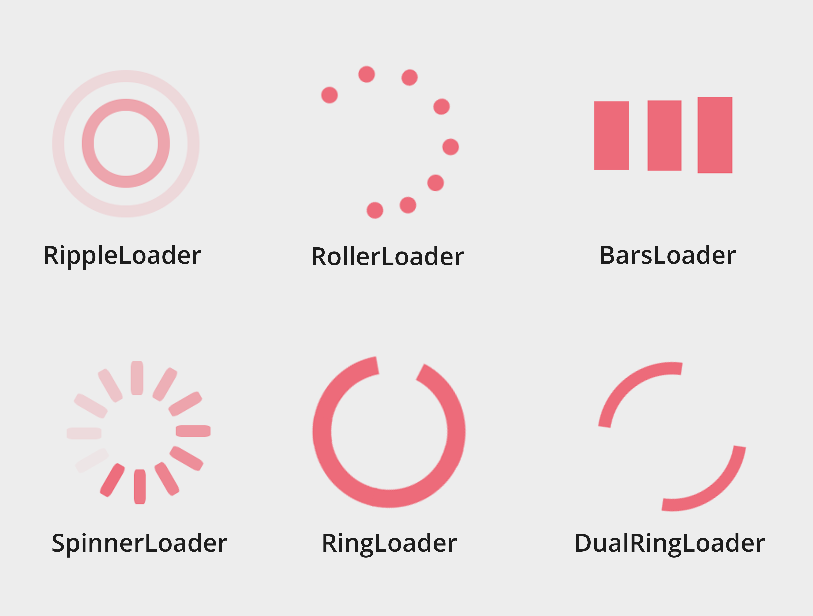

# awesome-css-spinners
a variation of customized, smooth, lightweight and puure HTML+CSS spinners

<p>this package was built based on loading.io  </p>
<h2>How to install ?</h2> 
<pre>
npm install awesome-css-spinners
</pre>

<br />

<h2>Examples:</h2>



<br />

<h1>How to use it ? </h1>

```
import React, {Component} from "react";
import {DualRingLoader} from "awesome-css-spinners";


class App extends Component {

	render() {
        return (
            <div className="App">            
                <RippleLoader/>
            </div>
        );
    }
}
export default App;
```

<h1>Available options to pass :</h1>

<p>loader color, default value is "black" </p>
```
<RippleLoader color="#ff7383"/> 
```

<p>loader animation speed, default value is "1.2s" </p>
```
<RippleLoader  duration="2.5s" />
```

<h1>Available spinners:</h1>
<p> RippleLoader , BarsLoader , DualRingLoader , RingLoader, RollerLoader, SpinnerLoader </p>


